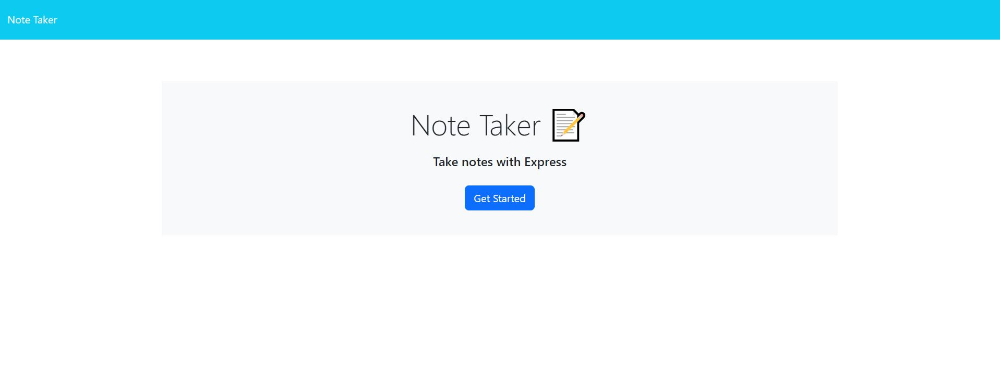
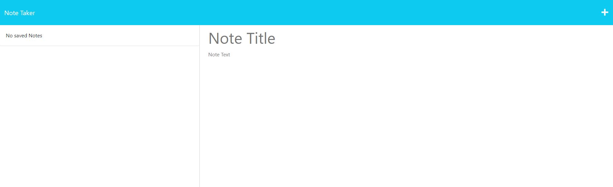
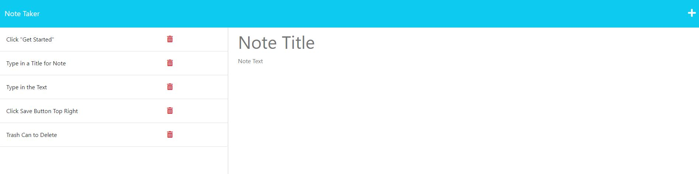
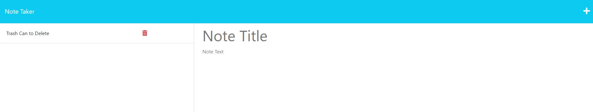

# <Note-Taker>

## Description

I wanted to build an easy-to-use application that allowed be to quickly add notes to my list. In particular, I wanted it to be able to to easily list out my 
tasks for the day in a clear and visual manner. And then I can delete tasks as I complete them throughout the day. This resulted in keeping me more organized and on track thoughout the day. This allowed me to get a good basic understanding of databases and persistent data.

## Usage

Click on the "Get Started" button as shown below.

You can start typing the title and text for your note. Both are required to be able to save a note.
Click the floppy disk icon in the upper right of the page to save the note.

Add however many notes you need.

Delete notes by clicking the trashcan icon next to the note in the list.

